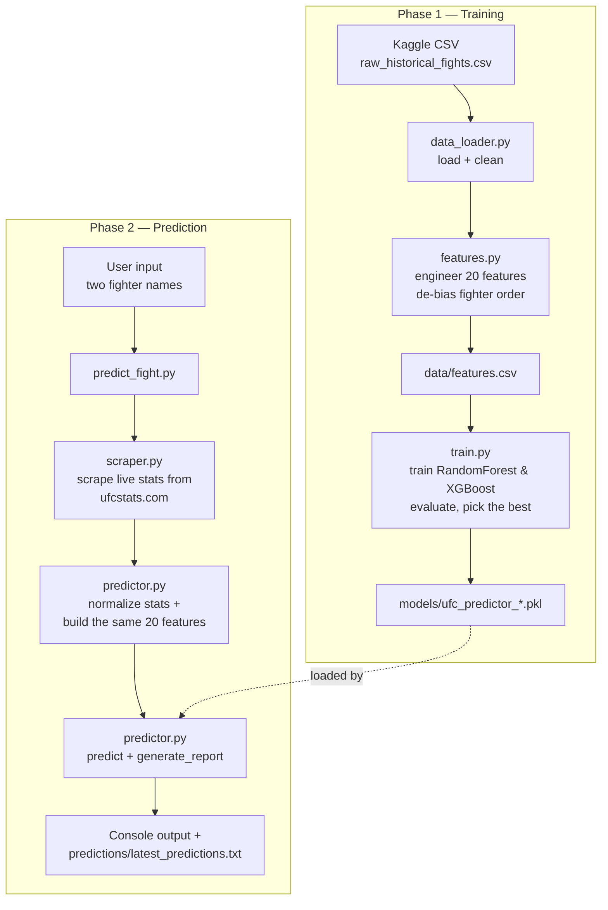
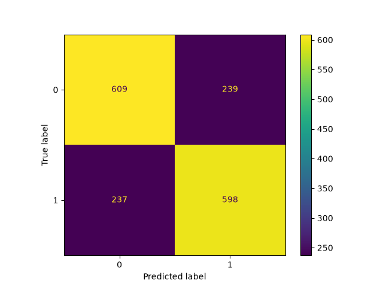
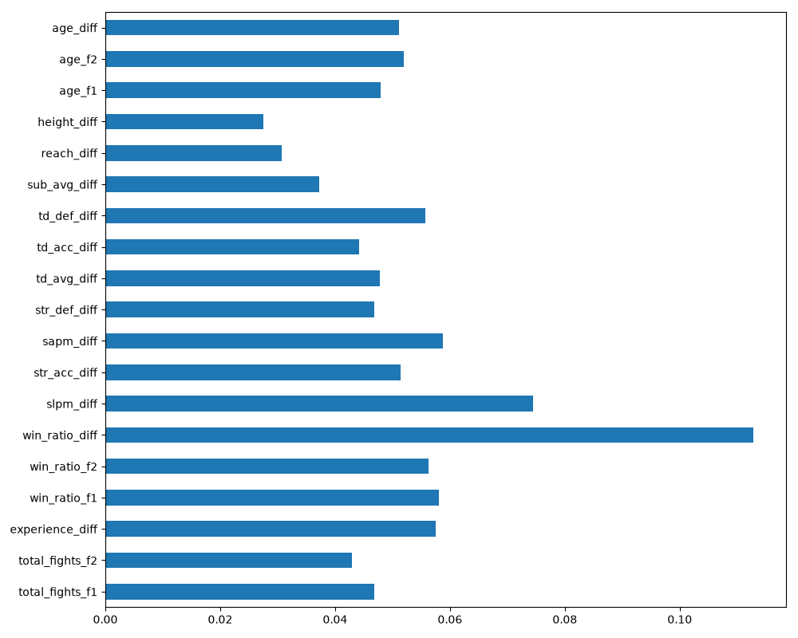
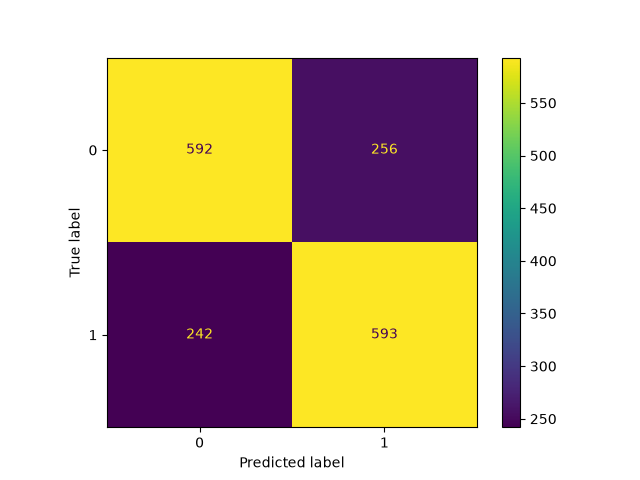
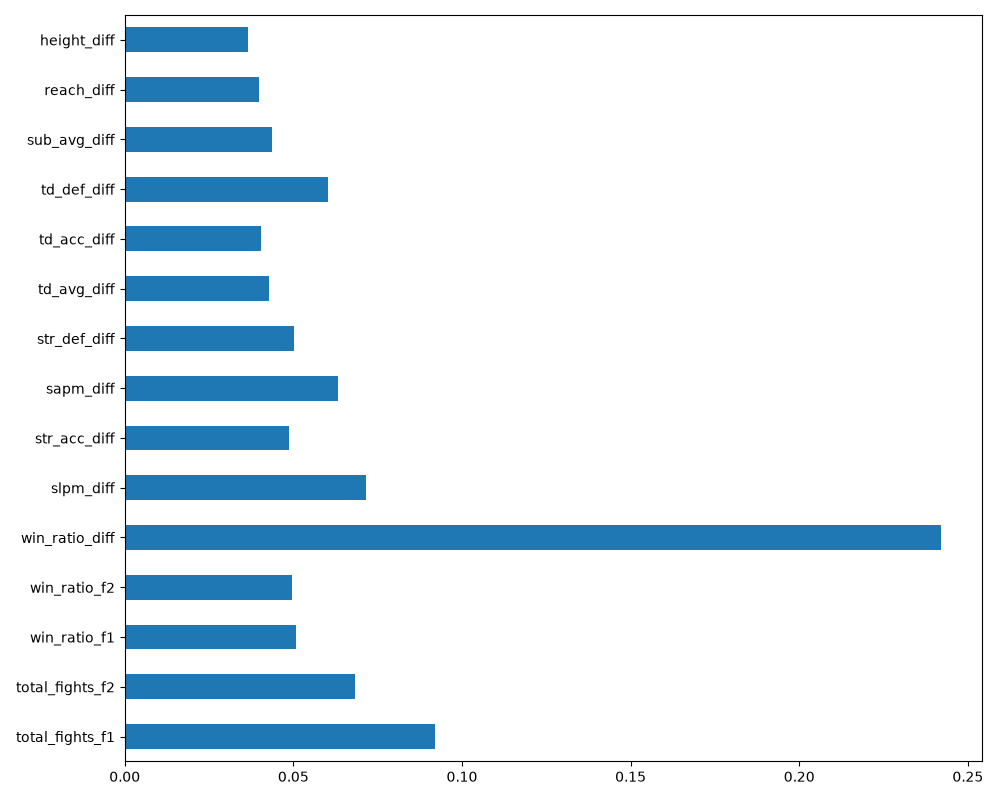

# UFC Fight Predictor

A machine learning system that predicts the outcome of UFC fights. It trains on thousands of historical fights, then scrapes a fighter's **current** stats from [ufcstats.com](http://ufcstats.com) on demand to predict the outcome of any matchup you ask it about: a real upcoming fight, or a hypothetical "fantasy fight" between fighters who've never actually met.

## How it works

The project is split into two phases:

**Phase 1 — Training** (`src/data_loader.py` → `src/features.py` → `src/train.py`)
Historical UFC fight data (from Kaggle) is cleaned, de-biased, and turned into 20 comparison features between two fighters (striking stats, grappling stats, experience, physical measurements, age). Two models, RandomForest and XGBoost, are trained and evaluated, and the better one is saved.

**Phase 2 — Prediction** (`src/scraper.py` → `src/predictor.py` → `predict_fight.py`)
Given two fighter names, the system scrapes each fighter's current stats live from ufcstats.com, builds the exact same 20 features the model was trained on, and returns a prediction with a confidence score and a full feature breakdown.



## Project structure

```
UFC Fight Predictor/
├── data/
│   ├── raw_historical_fights.csv    (Kaggle download — not committed, see Setup)
│   ├── cleaned_fights.csv           (generated by data_loader.py)
│   └── features.csv                 (generated by features.py)
├── models/
│   ├── ufc_predictor_<ModelName>_model.pkl   (generated by train.py — not committed)
│   └── plots/                       (confusion matrices & feature importance, per model)
├── notebooks/
│   └── 01_exploration.ipynb         (data exploration & key findings, see below)
├── predictions/
│   └── latest_predictions.txt       (written by predict_fight.py)
├── src/
│   ├── data_loader.py               (load + clean the raw historical data)
│   ├── features.py                  (engineer the 20 model features)
│   ├── train.py                     (train, evaluate, and save the model)
│   ├── scraper.py                   (scrape a fighter's current stats)
│   └── predictor.py                 (normalize scraped stats, predict, report)
├── predict_fight.py                 (main entry point — run this to get a prediction)
├── requirements.txt
└── README.md
```

## Setup

1. **Clone the repo and set up a virtual environment:**
   ```
   python3 -m venv venv
   source venv/bin/activate
   pip install -r requirements.txt
   playwright install chromium
   ```
   (`playwright install` downloads a bundled Chromium browser. Needed because ufcstats.com serves a JavaScript anti-bot challenge that a plain HTTP request can't get past.)

2. **Get the historical training data:** Download a UFC historical fights dataset from Kaggle (fighter records, physical stats, and per-fight results for both corners) and save it as `data/raw_historical_fights.csv` (used: https://www.kaggle.com/datasets/scarekrow/ufc-data).

3. **Build the model**: the trained model is *not* committed to this repo (it's a large binary and fully reproducible from code + data), so you need to generate it once:
   ```
   python3 -m src.features
   python3 src/train.py
   ```
   The first command cleans the raw data and engineers the features into `data/features.csv`; the second trains RandomForest and XGBoost, evaluates both, and saves the better one to `models/`.

## Usage

Once a model exists in `models/`, just run the main entry point:

```
python3 predict_fight.py
```

It'll ask for two fighter names, scrape their current stats, and print (and save to `predictions/latest_predictions.txt`) a full report: every feature value that went into the prediction (with an explanation of which direction favors which fighter), the predicted winner, the win probability for each fighter, and (if the matchup spans very different weight classes) a warning that the prediction is extrapolating beyond anything the model saw in training.

Any two fighter names that exist on ufcstats.com work, including matchups that could never happen in reality (different weight classes, retired vs. active fighters, etc.). That's a deliberate feature, not a limitation of scope. See **Known Limitations** below for how reliable those predictions actually are.

## Model performance

The best model (RandomForest, 200 trees) reaches **~71.8% test accuracy**, meaningfully better than the 50% coin-flip baseline, though nowhere near 90%+. That's not a shortcoming of the modeling: MMA has high inherent variance (a single strike, a bad scorecard, an injury can flip a fight), and even professional betting markets, with access to far more information, don't do dramatically better on competitive matchups.

### Evaluation metrics

Both models were evaluated on the same held-out 20% test split (never seen during training):

| Metric | RandomForest | XGBoost |
|---|---|---|
| Accuracy | **71.78%** | 70.11% |
| Precision | 71.58% | 69.30% |
| Recall | 71.50% | 71.38% |
| F1-Score | 71.54% | 70.32% |

RandomForest was chosen because it has the higher **accuracy**, but the choice of metric mattered less here than it often does: precision, recall, and F1 all land within about a percentage point of accuracy for both models, so every metric tells the same story. RandomForest is consistently a bit ahead, not just on the one score used to decide.

**Why accuracy, specifically, is a reasonable metric to decide on here:** Precision and recall trade off against each other by design. Optimizing for one usually costs the other, so which one "matters more" depends on whether false positives or false negatives are more costly for the task. That's true for something like medical screening (missing a real case is worse than a false alarm), but not here: predicting "Fighter A wins" when Fighter B actually wins isn't inherently worse than the reverse mistake, both outcomes are symmetric, equally important, and equally likely a priori (the target is close to 50/50 by design, thanks to `debias_fighter_order()`). With no class imbalance and no asymmetric cost between the two error types, plain accuracy, the overall fraction of correct predictions, is a fair, simple, and easy-to-interpret way to compare the models, without needing to justify weighting one kind of mistake over the other.

The strongest individual predictor by a clear margin is career **win ratio difference**, followed by striking output and defensive stats. Physical measurements (height, reach, weight) matter least in training, as expected, since real fights are matched within one weight class, so those differences are usually small between opponents. See the exploration notebook for the full feature importance breakdown.

**RandomForest**

| Confusion Matrix | Feature Importance |
|---|---|
|  |  |

**XGBoost**

| Confusion Matrix | Feature Importance |
|---|---|
|  |  |

*(These plots are regenerated every time `train.py` runs, so they'll reflect your own local training run once you generate the model — see Setup.)*

## Known limitations

- **Career stats aren't point-in-time:** The aggregate stats used as features (win/loss record, striking accuracy, etc.) reflect each fighter's *final* career totals, not their record as it stood at the time of each specific historical fight, so reported backtest accuracy is likely slightly optimistic. This doesn't affect real predictions, though: for an actual upcoming fight, "current totals" and "totals at the time of the fight" are the same thing by definition.
- **Cross-weight-class "fantasy fight" predictions should be taken with a grain of salt:** Real UFC fights are always matched within one weight class, so the model has very little training data showing what happens when two fighters differ hugely in size. `predict_fight.py` flags this explicitly when it detects an unusually large height/weight gap for the matchup.
- **Fighter search is last-name-only:** ufcstats.com's search doesn't handle full-name queries well, so the scraper searches by last name across all result pages and filters for an exact first+last name match. An unusual or ambiguous name might need adjusting.

## Exploration notebook

[`notebooks/01_exploration.ipynb`](notebooks/01_exploration.ipynb) is a retrospective walkthrough of the key data investigations behind this project: the CSV-parsing gotcha, the missing-value analysis, the point-in-time and fighter-order data leakage discoveries, feature importance, and the hyperparameter exploration behind `n_estimators=200`. It reuses the real project code from `src/` rather than duplicating logic, so it stays in sync with the pipeline.

## Tech stack

- **Data & ML:** pandas, numpy, scikit-learn, XGBoost, joblib
- **Scraping:** Playwright (headless Chromium, needed to get past ufcstats.com's JS challenge), BeautifulSoup
- **Visualization:** matplotlib
